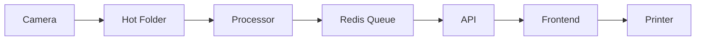

# 🌈 ChromaFlow

ChromaFlow is a streamlined solution for automating green screen background removal and instant photo printing. Perfect for events, parties, and photoshoots!

## 📸 Concept

1. Take a photo with a green screen
2. Image is automatically processed
3. Background is replaced with your chosen scene
4. Print the result instantly!

## ✨ Features

- 🎯 **Automatic Processing**: Smart detection and removal of green screens
- 🖼️ **Custom Backgrounds**: Library of scenes to replace the green screen
- ⚡ **Real-time**: On-the-fly processing of new photos
- 🖨️ **Direct Printing**: Automatic sending to configured printer
- 📊 **Queue Management**: Real-time status tracking of photos
- 🎨 **Web Interface**: User-friendly control panel
- 🔄 **Hot Folder**: Automatic detection of new photos
- 📱 **Responsive Design**: Works on desktop and tablets

## 🎯 Use Cases

Perfect for:
- 🎉 Parties and events
- 📸 Professional photoshoots
- 🎭 Photo booths with themed backgrounds
- 🎪 Event entertainment
- 🎓 Graduation ceremonies
- 💑 Weddings
- 🏢 Corporate events

## 🚀 Installation

### Prerequisites

- Node.js (v18+)
- Python 3.10+
- Redis
- A configured default printer
- A green screen and good lighting!

### Quick Setup

1. Clone the repository:
```bash
git clone https://github.com/gallionlabs/chroma-flow.git
```

2. Install dependencies:
```bash
cd chroma-flow
npm install
cd ../processor
pip install -r requirements.txt
```

3. Start all services:
```bash
./start.sh
```

4. Access the interface: http://localhost:5173

## 📝 Usage

### Initial Setup

1. **Printer Configuration**
   - Ensure your default printer is set
   - Test print quality and paper size
   - Configure printer settings in `config.yml`

2. **Background Scenes**
   - Add your background images to `data/scenes`
   - Supported formats: JPG, PNG
   - Recommended resolution: 3000x2000px or higher

3. **Green Screen Setup**
   - Use a non-reflective green screen
   - Ensure even lighting
   - Avoid wrinkles in the fabric
   - Keep subjects 3-6 feet from the screen

### During the Event

1. **Photo Capture**
   - Take photos with consistent lighting
   - Ensure subjects don't wear green
   - Maintain focus quality

2. **Processing**
   - Photos in `data/images_to_process` are automatically detected
   - Progress visible in web interface
   - Failed processing is logged for review

3. **Printing**
   - Preview before printing
   - Adjust settings if needed
   - Monitor printer status

## 🛠️ Configuration

### Environment Variables

```env
PORT=3000
REDIS_HOST=localhost
REDIS_PORT=6379
PRINTER_NAME=default
PROCESS_TIMEOUT=30
```

### Printer Settings

```yaml
printer:
  format: "4x6"
  dpi: 300
  color: true
  quality: "high"
```

## 📁 Folder Structure

```
chroma-flow/
├── frontend/          # React application
│   ├── src/          # Source files
│   └── public/       # Static assets
├── api/              # Express server
│   ├── src/         # API source files
│   └── dist/        # Compiled files
├── processor/        # Python image processor
│   ├── src/         # Processing logic
│   └── venv/        # Python virtual environment
├── data/
│   ├── images_to_process/  # Input folder
│   ├── processed_images/   # Output folder
│   ├── scenes/            # Background images
│   └── temp/             # Temporary files
└── logs/                 # Application logs
```

## ⚠️ Troubleshooting

### Common Issues

1. **Green Screen Detection**
   - Check lighting uniformity
   - Verify green screen color (use RGB: 0, 255, 0)
   - Clean the screen surface
   - Adjust distance from subject

2. **Printing Problems**
   - Verify printer connection
   - Clear print queue if stuck
   - Restart printer service

3. **Performance Issues**
   - Monitor Redis connection
   - Check disk space
   - Verify CPU usage
   - Clean temp folders

### Logs

- Frontend: `logs/frontend.log`
- API: `logs/api.log`
- Processor: `logs/processor.log`

## 🔧 Technical Architecture

### Components

1. **Frontend (React/TypeScript)**
   - Real-time updates via Socket.IO
   - Material UI components
   - State management with React Context
   - Responsive design

2. **API (Node.js/Express)**
   - RESTful endpoints
   - WebSocket support
   - Queue management
   - Printer interface

3. **Processor (Python)**
   - Image processing with OpenCV
   - Background removal with rembg
   - File system monitoring
   - Queue integration

### Communication Flow



## 🤝 Contributing

1. Fork the repository
2. Create your feature branch (`git checkout -b feature/AmazingFeature`)
3. Commit your changes (`git commit -m 'Add some AmazingFeature'`)
4. Push to the branch (`git push origin feature/AmazingFeature`)
5. Open a Pull Request

## 📝 License

This project is licensed under the MIT License - see the `LICENSE` file for details.

## 🙏 Acknowledgments

Built with:
- [rembg](https://github.com/danielgatis/rembg) for background removal
- [React](https://reactjs.org/) for the frontend interface
- [Express](https://expressjs.com/) for the API
- [Redis](https://redis.io/) for queue management
- [Socket.IO](https://socket.io/) for real-time updates
- [Material UI](https://mui.com/) for UI components

## 📞 Support

- 📧 Email: support@gallionlabs.com
- 💬 Discord: [Join our server](https://discord.gg/gallionlabs)

---

Made with ❤️ to make your events more magical!